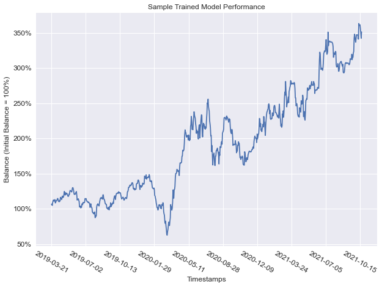

# Reinforcement Learning in FX Trading

This is a reinforcement learning approach to trading in the foreign exchange market. The trained algorithm interprets market data and estimates the optimal actions based on the learnt strategy. The details are provided in this [explanation paper](Reinforcement_Learning_in_Foreign_Exchange_Trading.pdf).  

The learning algorithm is the Tensorflow 2 implementation of [Twin Delayed Deep Determinsitic Policy Gradients (TD3), (Fujimoto et al., 2018)](https://arxiv.org/abs/1802.09477). It trades in a forex environment with the goal of trading strategy construction and optimisation of the spreadbetting task (other tasks/instruments, such as CFDs, can also be accommodated through updating the reward function).

The main prupose is to allow the learning algorithm to learn trading the securities the chosen by the user and to formulate a systemetic trading strategy for implementation.


## Quick Example
This repository contains a pre-trained model that trades EUR/USD, learnt from historical data (Mar/2012 - Mar/2019). The networks are trained using Tensorflow 2.6.0 and Python 3.8.
The trading result:  



The simpliest way to use the trained model is by opening the [Pre_trained_Implementation](Pre_trained_Implementation.ipynb) notbook and providing a path to the daily historical EUR/USD price data of the past 55 days or more, including the current day, in a .csv format. E.g.

```
dataset_path = 'EURUSD_price_data.csv'
```

After running all the cells, the output is the current estimated optimal action given by the pre-trained model.


## Usage
(I) Use the sample pre-trained model for trading EUR/USD [here](Pre_trained_Implementation.ipynb)  
(II) Backtest the pre-trained model with the user's broker price data [here](Pre_trained_Model_Performance.ipynb)  
(III) Train a new model to trade a new currency or a portfolio of currencies at once [here](TD3_tf2_Forex.ipynb)  

The technical instructions are detailed in the respective IPython notebooks.

Regardless of the usage, the historical price data from the user's broker must be provided in locations marked ***(User-input required)***. The dataset is generally expected to be in the .csv format with index and columns as shown:

| Index | Bid Open | Bid High | Bid Low | Bid Close | Ask Open | Ask High | Ask Low | Ask Close |
| :---: | :------: | :------: | :-----: | :-------: | :------: | :------: | :-----: | :-------: |
| Timestamp_0 | ... | ... | ... | ... | ... | ... | ... | ... |
| Timestamp_1 | ... | ... | ... | ... | ... | ... | ... | ... |
| Timestamp_2 | ... | ... | ... | ... | ... | ... | ... | ... |
|     ...     | ... | ... | ... | ... | ... | ... | ... | ... |
| Timestamp_n | ... | ... | ... | ... | ... | ... | ... | ... |


## Disclaimer
The author is not a registered investment, legal or tax advisor or a broker/dealer. All investment/financial opinions expressed by the author are from personal research and are intended as educational material. The content is intended to be used for informational purposes only. It is very important to do your own research before making any investment based on your own personal circumstances. You should take independent financial advice from a professional in connection with, or independently research and verify, any information that you find on this repository and wish to rely upon, whether for the purpose of making an investmet decision or otherwise.
